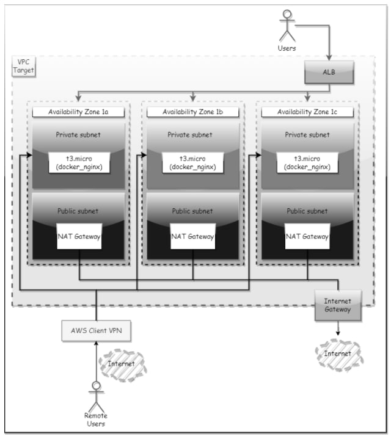

# Terraform

### About (main point)
* Raised a VPC with 3 "private" and 3 "public" subnets in 3 different AZs.
* Raised AWS Client VPN with access to private subnets
* Created SSH key in AWS
* Created 3 EC2 t3.micro instances on private subnets (one on each), and attached ssh key to each.
* Created a public ALB on the public subnets, and attached the EC2 instances.
* Created SG for EC2 and ALB so that ALB could be accessed from the ip address of the workstation calling Terraform on port 80 so that ALB could be accessed from EC2 so that EC2 could be accessed from ALB (!).
* Installed nginx on EC2 using remote-exec provisioner, configured docker on it, on which I raised the static page.
* All resources have been tagged as follows:
    - Student: borys.bilkevych
    - Terraform: true
* Default provider tags feature of AWS provider was in use.

### About (bonus point)
* Bind wildcard certificate to ACM via Route53 DNS validation
* Created an HTTPs listener in ALB and enable HTTP > HTTPs redirection in ALB.
* Added HTTPs to SG for ALB
* Attached the Route53 entry to the ALB
* Created and attach a WAF rule to the ALB that limits the number of requests per second to 1000.

### Architecture  diagram


### How to use the VPN

__Requirements__:
* <ins>OpenVPN</ins>

Clone the repository and go to the vpc state (folder /vpc). Run the `terragrunt plan` and then `terragrunt apply --auto-approve` inside the vpc state, you will get the result: <ins>VPN</ins> installed in your AWS, then follow the instruction below. 
Use the `terragrunt destroy --auto-aprove` if you want to delete everything from AWS.

__Instruction__:

1. Create the .opvn file. Use the command: `terragrunt output -raw client_configuration > borys.bilkevych.ovpn`
2. Then save the file in the OpenVPN configuration files and connect via OpenVPN with the new configuration to our VPN.

### Remote State + Locking

__S3 config:__ 
```yaml
locals {
  aws_region       = <aws_region>
  aws_account_id   = <account_id>
  env              = "staging"
  alias             = "alias/bbilkevych_terraform_kms"
}

remote_state {
  backend = "s3"
  config = {
    encrypt        = true
    kms_key_id     = "arn:aws:kms:${local.aws_region}:${local.aws_account_id}:${local.alias}"
    bucket         = "bbilkevych-${local.aws_account_id}-terraform-state"    
    s3_bucket_tags = {
      Terragrunt   = "true"
      Owner        = "borys.bilkevych"
    }
    
    key            = "${local.aws_region}/${path_relative_to_include()}/terraform.tfstate"
    dynamodb_table = "bbilkevych-terraform-${local.env}-${local.aws_account_id}-lock-state"
    region         = local.aws_region
    
    dynamodb_table_tags = {
      Terragrunt = "true"
      Owner      = "borys.bilkevych"
    }
  }
}

inputs = {
  aws_region             = local.aws_region
  allowed_aws_account_id = local.aws_account_id

  terraform_remote_state_s3_bucket      = "bbilkevych-${local.aws_account_id}-terraform-state"
  terraform_remote_state_dynamodb_table = "terraform-lock-state"
  terraform_remote_state_file_name      = "terraform.tfstate"

  default_provider_tags = {
    Terraform    = "true"
    Student      = "borys.bilkevych"
  }
}
```
__Vesrions lock:__
```yaml
Versions lock:
    terraform: 1.1.4
    Providers:
        aws: 3.74.0
        awsutils: 0.11.0
    Modules:
        cloudposse/vpc/aws: 0.28.1
        cloudposse/dynamic-subnets/aws: 0.39.8
        cloudposse/ec2-client-vpn/aws: 0.10.8
        cloudposse/security-group/aws: 0.4.3
        cloudposse/label/null: 0.25.0
        umotif-public/waf-webaclv2/aws: 3.5.0
        terraform-aws-modules/key-pair/aws: 1.0.1
        terraform-aws-modules/alb/aws: 6.6.1
        terraform-aws-modules/acm/aws: 3.0
```